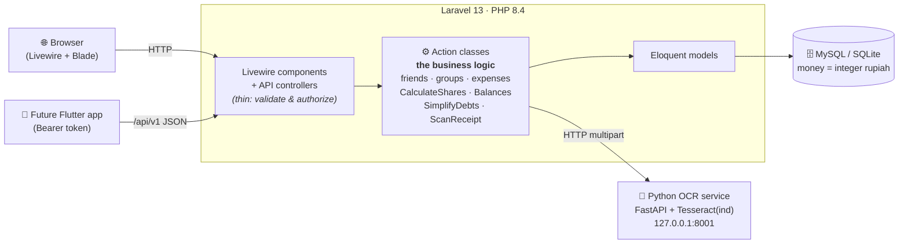

<div align="center">

# 💸 SplitBill

**A Splitwise-style bill-splitting web app built for Indonesian groups — friends, groups, shared expenses, settlements, and receipt OCR.**

Rupiah-first · mobile-first · powered by Laravel + Livewire + a Python OCR microservice.

[](https://github.com/FabianOkky/splitbill/actions/workflows/tests.yml)
[](https://github.com/FabianOkky/splitbill/actions/workflows/lint.yml)
[](LICENSE)
[](https://www.php.net/)
[](https://laravel.com/)

</div>

---

## What is SplitBill?

Splitting a bill among friends shouldn't need a spreadsheet. **SplitBill** tracks who
paid, who owes whom, and the **minimal set of payments** needed to settle up — all in
**Indonesian Rupiah**, stored as integers so the numbers always add up to the exact total
(no floating-point cents).

You add friends by a short **friend code**, create a **group** (e.g. _"Trip Bali"_), log
**expenses** with one of three split methods, and the app computes everyone's balance.
Snap a photo of an Indonesian **receipt (struk)** and a small Python service reads the
total and line items so you don't have to type them.

The same business logic powers both the web UI **and** a Sanctum-secured JSON API, so a
future Flutter app gets the exact same behaviour for free.

> **Why this repo is worth a look (portfolio notes):** clean **Action-class architecture**
> (logic shared by web + API, never duplicated), money handled as integer minor units with
> deterministic rounding, a **swappable OCR microservice** behind a stable HTTP contract,
> policy-based authorization on every action, and ~240 Pest tests covering the split and
> settlement math edge cases.

## Features

| | |
|---|---|
| 🧾 **Dashboard** | At-a-glance summary of what you're owed, what you owe, your net balance, and your position in every group — plus quick links and friend-code sharing. |
| 👥 **Friends** | Every user gets a public 8-char friend code. Add by code, send / accept / decline requests, with auto-accept on reciprocal requests. |
| 🗂️ **Groups & expenses** | Create a group, add friends, and log expenses with three split methods: **equal**, **exact** (rupiah per person), or **percent**. Edit and delete expenses. |
| ⚖️ **Balances & settlements** | Per-member net balance and a **"who pays whom"** minimal-transfer list per group. Settlements are append-only for a clean audit trail. |
| 📸 **Receipt OCR** | Upload a struk photo; the Python service (Tesseract 5 + `ind`) parses the total and line items in Indonesian receipt format. Degrades gracefully when offline. |
| 🔔 **Activity & notifications** | Every meaningful change posts to the group's activity feed and the user's notification bell. |
| 🔌 **JSON API** | Sanctum bearer tokens, versioned at `/api/v1`, throttled. The web UI and API share the same Actions, so they never drift. See [`docs/api.md`](docs/api.md). |
| 🌙 **Mobile-first UI** | Responsive Livewire + Flux UI, tested down to 375px, with light/dark themes. |

## Screenshots

The fastest way to see the UI is to **run it locally — it's a two-minute setup** (see
[Quick start](#quick-start)). Register two accounts, swap friend codes, create a group,
and log an expense to watch the balances update live.

## Architecture

Business logic lives in plain PHP **Action classes** (`app/Actions/`) — one class, one
operation. Livewire components and API controllers stay thin: they validate input,
authorize via Policies, then call the **same** Action. Money is stored as **integer
rupiah**. The OCR service is a separate process Laravel only ever reaches over HTTP.



Why this matters: when the Flutter client arrives, each endpoint is just a thin controller
+ an API Resource reusing an existing Action — almost no new logic, no behaviour drift.

- Full production runbook: [`docs/deploy.md`](docs/deploy.md)
- OCR contract & engine swap: [`ocr-service/README.md`](ocr-service/README.md)

## Tech stack

| Layer | Choice |
|---|---|
| Backend | PHP 8.4, Laravel 13 |
| Web UI | Livewire 4 + Flux UI (free) + Tailwind CSS 4 |
| Auth | Laravel Fortify (email + password, password confirmation) |
| API | Laravel Sanctum (bearer tokens) |
| OCR | Python 3.11+ · FastAPI · Tesseract 5 (`ind`), swappable to RapidOCR |
| Database | MySQL by default · SQLite for tests · MariaDB-ready via `.env` |
| Tests | Pest 4 (Feature + Unit) · ~240 tests |
| Code style | Laravel Pint |

## Project structure

```
app/
├── Actions/            # ← business logic (the brain), shared by web + API
│   ├── Dashboard/      #   cross-group balance summary
│   ├── Expenses/       #   AddExpense, EditExpense, ScanReceipt, ...
│   ├── Settlements/    #   CalculateGroupBalances, SimplifyDebts, RecordSettlement
│   └── Splitting/      #   CalculateShares (equal / exact / percent, deterministic remainder)
├── Livewire/           # thin UI components (validate → call Action)
├── Http/
│   ├── Controllers/Api/V1/   # thin API controllers (reuse the same Actions)
│   └── Resources/V1/         # JSON shaping (int amounts + *_formatted rupiah)
├── Models/             # Eloquent relations, casts, scopes — no business rules
├── Policies/           # authorization (own data / group membership only)
└── Support/Money.php   # integer-rupiah formatter
ocr-service/            # standalone Python FastAPI + Tesseract microservice
docs/                   # getting-started, api, deploy guides
tests/                  # Pest Feature + Unit suites
```

## Quick start

> **Prerequisites:** [Laravel Herd](https://herd.laravel.com/) (PHP 8.4 + Composer),
> Node.js 22 LTS, Git, Python 3.11+, and Tesseract 5 with the **Indonesian** language pack.
> A full step-by-step guide (with troubleshooting) lives in
> **[`docs/getting-started.md`](docs/getting-started.md)**.

```powershell
# 1. Clone
git clone https://github.com/FabianOkky/splitbill.git
cd splitbill

# 2. One-shot setup: installs deps, copies .env, generates key, migrates, builds assets
composer setup

# 3. Run the web app (Laravel server + queue + Vite, all at once)
composer dev
# → http://localhost:8000   (or http://splitbill.test with Herd)
```

`composer setup` defaults to **SQLite** if you haven't configured MySQL, so you can be
clicking around in under two minutes. To use MySQL instead, set `DB_CONNECTION=mysql` and
the `DB_*` values in `.env` before running it (see the getting-started guide).

## Running the OCR service

The receipt scanner is an independent Python process. The web app works fine without it —
expense entry just falls back to manual — but here's how to bring it up:

```powershell
cd ocr-service
python -m venv .venv
.venv\Scripts\activate
pip install -r requirements.txt
uvicorn main:app --host 127.0.0.1 --port 8001
```

Then smoke-test the Laravel ↔ Python boundary from the repo root:

```powershell
php artisan ocr:health     # exits 0 when the service is up
php artisan ocr:scan path\to\receipt.jpg
```

> **Windows / Tesseract:** you do **not** need Tesseract on your `PATH`. The service
> auto-detects the standard UB-Mannheim install at
> `C:\Program Files\Tesseract-OCR\tesseract.exe`. If yours lives elsewhere, set
> `TESSERACT_CMD` to its full path. The `ind` language pack must be installed for
> Indonesian receipts. Details: [`ocr-service/README.md`](ocr-service/README.md).

## Running tests

```powershell
# Laravel — Pint style check + the full Pest suite
composer test

# or just the tests, compact output
php artisan test --compact

# OCR service (pytest), inside ocr-service/
pytest
```

The OCR integration spec at `tests/Feature/Expenses/ScanReceiptIntegrationTest.php`
auto-skips unless the Python service is reachable, so CI stays green without it.

## API

A versioned JSON API lives under `/api/v1`, secured with Sanctum bearer tokens and
throttled per route group. Because the API and the web UI share the same Action classes,
parity is automatic. Amounts are returned both as integers and as `*_formatted` rupiah
strings. Full endpoint list and example requests: **[`docs/api.md`](docs/api.md)**.

## Roadmap

- Multi-payer expenses (two or more people chip in for one purchase).
- Edit / undo settlements via compensating records (append-only audit trail).
- Group archive / leave / delete with balance-safety checks.
- Expense categories + spending insights.
- 2FA / passkeys before a public launch.

Lower-priority ideas: multi-currency, push notifications, recurring expenses, CSV export,
guest members, and `id`/`en` localization.

## License

[MIT](LICENSE) © 2026 Fabian Okky.
